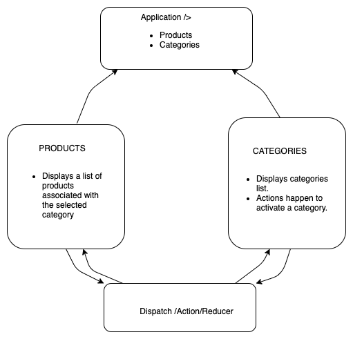

# Store App Using React Redux
## Author: Edgar Romero, Jonathon Lee
### Links and Resources
--->> testing a git commit
- Class-36 [Pull Request](https://github.com/jonnyleealas/store-app/pull/7)
- Class-37 [Pull Request](https://github.com/jonnyleealas/store-app/pull/9)
- Class-37 [Pull Request](https://github.com/jonnyleealas/store-app/pull/21)

- ci/cd (GitHub Actions)
- back-end server url (when applicable)
- front-end application (when applicable)

<br>

 #### [Phase 1 Requirements](https://canvas.instructure.com/courses/2168372/assignments/16248980)
 #### [Phase 2 Requirements](https://canvas.instructure.com/courses/2168372/assignments/16248981)
 #### [Phase 3 Requirements](https://canvas.instructure.com/courses/2168372/assignments/16248982)
 #### [Phase 4 Requirements]() -->
 #### [Business and Technical Requirements]()
 
<br>

## Setup
To initialize as an npm project, run the following command:
<br>

- `git clone https://github.com/jonnyleealas/store-app.git`


- `npm install`

Dependencies: 
```
 "dependencies": {
    "@material-ui/core": "^4.11.2",
    "@material-ui/icons": "^4.11.2",
    "@testing-library/jest-dom": "^5.11.6",
    "@testing-library/react": "^11.2.2",
    "@testing-library/user-event": "^12.5.0",
    "react": "^17.0.1",
    "react-dom": "^17.0.1",
    "react-redux": "^7.2.2",
    "react-scripts": "4.0.1",
    "redux": "^4.0.5",
    "web-vitals": "^0.2.4"
  },

```


## How to initialize/run your application (where applicable)
TO RUN THE APPLICATION--
In the Terminal(s) run: `npm start `


## Tests
Tests are handled with the jest testing library. Install jest to the dev dependencies. Follow the command:
`npm i --save-dev jest`

<br>


## UML Phase1
